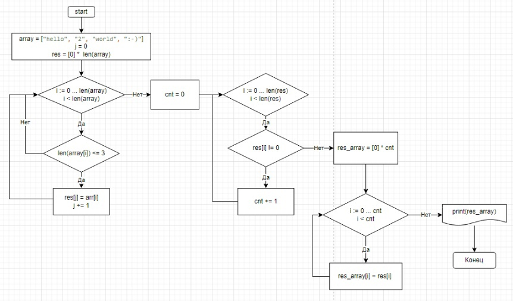

# Итоговая контрольная работа по основному блоку
## Задание на контрольную работу:  Написать программу, которая из имеющегося массива строк формирует новый массив из строк, длина которых меньше, либо равна 3 символам. Первоначальный массив можно ввести с клавиатуры, либо задать на старте выполнения алгоритма. При решении не рекомендуется пользоваться коллекциями, лучше обойтись исключительно массивами.

## 1) Ссыска на репозиторий в [GitHub]()

## 2) Блок-схема алгоритма

## 3)Программа: код предствлен в файле Code.md
